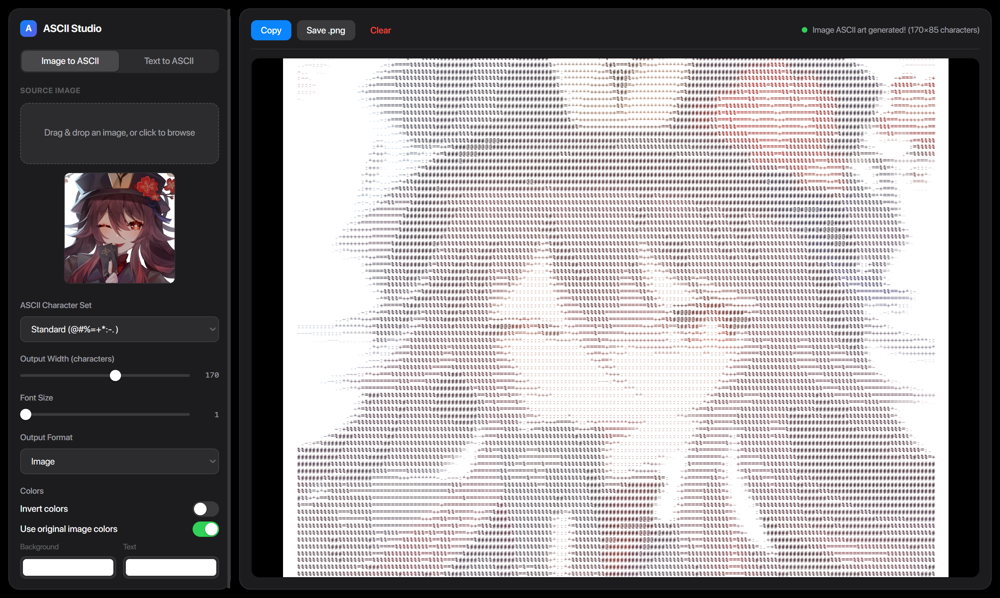

<div align="center">

# ASCII Studio

**Turn images and text into ASCII art — right in your browser.**

A fast, fully client-side ASCII art generator. Drop in an image or type some text, fine-tune the output, and export as plain text or a rendered PNG.

[](https://jazsi.github.io/ASCII-Studio/)
[](LICENSE)


<a href="https://jazsi.github.io/ASCII-Studio/"><strong>▶ Open the live app</strong></a>

<br />



</div>

---

## ✨ Features

- **🖼️ Image → ASCII** — drag & drop or browse (JPEG, PNG, GIF, BMP, WebP, SVG, TIFF, ICO; up to 10 MB).
- **🔤 Text → ASCII** — render words as 5-row block-font banners (up to 20 characters).
- **🎨 Character ramps** — Standard `@#%=+*:-.`, Simple `█▓▒░`, Dots `●◐○◌`, or your own **custom** set.
- **🌈 Color control** — keep the image's original colors, or pick custom background/text colors. Optional **invert**.
- **📤 Export anywhere** — copy to clipboard, download as `.txt`, or save a rendered `.png`.
- **📐 Tunable output** — adjustable character width and font size.
- **📱 Responsive** — sidebar collapses gracefully on small screens.
- **🔒 100% client-side** — images never leave your browser; no uploads, no servers.

## 🛠️ Tech Stack

| Layer        | Choice                                                       |
| ------------ | ------------------------------------------------------------ |
| Framework    | [React 19](https://react.dev) + [React Compiler](https://react.dev/learn/react-compiler) |
| Language     | [TypeScript](https://www.typescriptlang.org)                 |
| Build tool   | [Vite](https://vite.dev)                                     |
| Runtime / PM | [Bun](https://bun.sh)                                        |
| Rendering    | Canvas 2D API                                                |

## 📦 Getting Started

### Prerequisites

- [Bun](https://bun.sh) `1.0+`

### Installation

```bash
# Clone the repository
git clone https://github.com/JAZSI/ASCII-Studio.git
cd ASCII-Studio

# Install dependencies
bun install

# Start the dev server (http://localhost:5173)
bun run dev
```

### Scripts

| Command           | Description                                   |
| ----------------- | --------------------------------------------- |
| `bun run dev`     | Start the Vite dev server with HMR            |
| `bun run build`   | Type-check and build for production (`dist/`) |
| `bun run preview` | Preview the production build locally          |
| `bun run lint`    | Run ESLint                                    |

## 🎛️ Usage

1. **Pick a mode** — *Image to ASCII* or *Text to ASCII* using the segmented control.
2. **Provide input** — drag & drop / browse for an image, or type your text.
3. **Tune the settings:**
   - **Character Set** — choose a built-in ramp or supply custom characters.
   - **Output Width** — number of characters per line (image mode).
   - **Font Size** — preview/render glyph size.
   - **Output Format** — `Text` (editable monospace) or `Image` (rendered canvas).
   - **Colors** — toggle *Invert* and *Use original image colors*, or set background/text colors.
4. **Export** — **Copy**, **Download .txt**, or **Save .png**.

## 🗂️ Project Structure

```text
src/
├─ components/              # Presentational UI
│  ├─ ModeToggle.tsx        #   Image/Text segmented control
│  ├─ ImageUpload.tsx       #   Drag-and-drop dropzone + preview
│  ├─ TextInput.tsx         #   Text entry
│  ├─ SettingsPanel.tsx     #   Character set, sliders, toggles, colors
│  └─ OutputPanel.tsx       #   Toolbar, status, text/canvas output
├─ hooks/
│  └─ useAsciiConverter.ts  # All state, effects & export actions
├─ lib/                     # Framework-free core
│  ├─ asciiData.ts          #   Character ramps & block-font data
│  └─ asciiUtils.ts         #   Conversion & canvas rendering
├─ assets/fonts/            # SF Pro Display (bundled by Vite)
├─ types.ts                 # Shared types
├─ constants.ts             # Defaults & limits
├─ App.tsx                  # Composition root
├─ main.tsx                 # Entry point
├─ index.css                # Theme tokens, @font-face, reset
└─ App.css                  # Component styles
```


## 🌐 Deployment

This repo ships a GitHub Actions workflow ([`.github/workflows/deploy.yml`](.github/workflows/deploy.yml)) that builds with Bun and publishes `dist/` to GitHub Pages on every push to `main`.

To enable it:

1. **Settings → Pages → Build and deployment → Source: GitHub Actions.**
2. Push to `main` (or run the workflow manually from the Actions tab).

> [!IMPORTANT]
> The Vite `base` is set to `/ASCII-Studio/` in [`vite.config.ts`](vite.config.ts). GitHub Pages serves project sites at `https://<user>.github.io/<repo-name>/`, so the **repository must be named `ASCII-Studio`** for assets to resolve. If you use a different repo name, update `base` to match `/<repo-name>/`.

## 📄 License

Distributed under the [MIT License](LICENSE).
